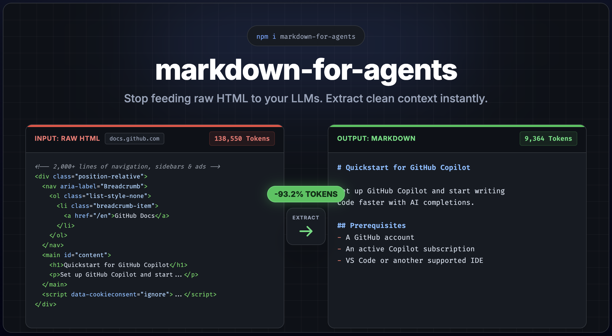

# markdown-for-agents

[](https://www.npmjs.com/package/markdown-for-agents) [](https://www.npmjs.com/package/markdown-for-agents)
[](https://pypi.org/project/markdown-for-agents/) [](https://github.com/KKonstantinov/markdown-for-agents/blob/main/LICENSE)

Runtime-agnostic HTML to Markdown converter built for AI agents. One dependency, works everywhere.

Convert any HTML page into clean, token-efficient Markdown — with built-in content extraction to strip away navigation, ads, and boilerplate. Inspired by [Cloudflare's Markdown for Agents](https://blog.cloudflare.com/markdown-for-agents/).

**[Try it in the playground](https://markdown-for-agents-playground.vercel.app)** — paste a URL or HTML and see the conversion live.



Audit any URL — no installation required:

```bash
npx @markdown-for-agents/audit https://docs.github.com/en/copilot/get-started/quickstart
```

```
           HTML            Markdown        Savings
───────────────────────────────────────────────────
Tokens     138,550         9,364           -93.2%
Chars      554,200         37,456          -93.2%
Words      27,123          4,044
Size       541.3 KB        36.6 KB         -93.2%
```

## Features

- **Runtime-agnostic** — Node.js, Bun, Deno, Cloudflare Workers, Vercel Edge, browsers
- **Content extraction** — strip nav, footer, ads, sidebars, cookie banners automatically
- **Framework middleware** — drop-in support for Express, Fastify, Hono, Next.js, and any Web Standard server
- **Content negotiation** — respond with Markdown when clients send `Accept: text/markdown`
- **Token estimation** — built-in heuristic token counter for LLM cost planning, with support for custom tokenizers
- **Plugin system** — override or extend any element conversion with custom rules
- **Single dependency** — only [htmlparser2](https://github.com/fb55/htmlparser2) (no DOM required)
- **ESM only** — modern, tree-shakeable, with subpath exports
- **Fully typed** — written in TypeScript with complete type definitions

## Install

```bash
# Core library
npm install markdown-for-agents

# Middleware (install only what you need)
npm install @markdown-for-agents/express
npm install @markdown-for-agents/fastify
npm install @markdown-for-agents/hono
npm install @markdown-for-agents/nextjs
npm install @markdown-for-agents/web
```

### Python

Also available as a pure Python package with zero dependencies:

```bash
pip install markdown-for-agents
```

See the [Python package docs](python/) for the full API, middleware (FastAPI, Flask, Django), and usage examples.

## Quick Start

```ts
import { convert } from 'markdown-for-agents';

const html = `
  <h1>Hello World</h1>
  <p>This is a <strong>simple</strong> example.</p>
`;

const { markdown, tokenEstimate } = convert(html);

console.log(markdown);
// # Hello World
//
// This is a **simple** example.

console.log(tokenEstimate);
// { tokens: 12, characters: 46, words: 8 }
```

## Content Extraction

Real-world HTML pages are full of navigation, ads, sidebars, and cookie banners. Enable extraction mode to get just the main content:

```ts
const { markdown } = convert(html, { extract: true });
```

This strips `<nav>`, `<header>`, `<footer>`, `<aside>`, `<script>`, `<style>`, ad-related elements, cookie banners, social widgets, and more. See the [Content Extraction guide](docs/extraction.md) for full details.

## Middleware

Serve Markdown automatically when AI agents request it via `Accept: text/markdown`. Each middleware is a separate package:

```ts
// Express
import { markdown } from '@markdown-for-agents/express';
app.use(markdown());

// Fastify
import { markdown } from '@markdown-for-agents/fastify';
fastify.register(markdown());

// Hono
import { markdown } from '@markdown-for-agents/hono';
app.use(markdown());

// Next.js (auto-unwraps /_next/image URLs)
import { withMarkdown } from '@markdown-for-agents/nextjs';
export default withMarkdown(handler);

// Any Web Standard server (Cloudflare Workers, Deno, Bun)
import { markdownMiddleware } from '@markdown-for-agents/web';
const mw = markdownMiddleware();
```

The middleware inspects the `Accept` header. Normal browser requests pass through untouched. When an AI agent sends `Accept: text/markdown`, the HTML response is automatically converted. See the [Middleware guide](docs/middleware.md) for full details and the
[Next.js example](examples/nextjs) for a complete working app.

### Caching

The middleware automatically sets headers to support proper HTTP caching:

- **`Vary: Accept`** — ensures CDNs and proxies cache HTML and Markdown responses separately, preventing an AI agent from receiving a cached HTML response (or vice versa).
- **`ETag`** — a content hash of the Markdown output, enabling conditional requests via `If-None-Match`. CDNs can serve `304 Not Modified` without hitting your origin server.

For production deployments, add `Cache-Control` at your infrastructure layer to control how long responses are cached:

```ts
// Example: cache Markdown responses for 1 hour at the CDN
app.use((req, res, next) => {
    if (req.headers.accept?.includes('text/markdown')) {
        res.setHeader('cache-control', 'public, max-age=3600');
    }
    next();
});
app.use(markdown());
```

The `contentHash` is also available on the core `convert()` result for custom caching strategies:

```ts
const { markdown, contentHash } = convert(html);
// contentHash: "2f-1a3b4c5" — use as a cache key or ETag
```

## Custom Rules

Override how any element is converted, or add support for custom elements:

```ts
import { convert, createRule } from 'markdown-for-agents';

const { markdown } = convert(html, {
    rules: [
        createRule(
            node => node.name === 'div' && node.attribs.class?.includes('callout'),
            ({ convertChildren, node }) => `\n\n> **Note:** ${convertChildren(node).trim()}\n\n`
        )
    ]
});
```

Custom rules have higher priority than defaults and are applied first. See the [Custom Rules guide](docs/rules.md) for the full API.

## Options

All options are optional. Defaults are shown below:

```ts
convert(html, {
    // Content extraction
    extract: false, // true | ExtractOptions

    // Custom conversion rules
    rules: [], // Rule[]

    // Base URL for resolving relative links and images
    baseUrl: '', // "https://example.com"

    // Heading style
    headingStyle: 'atx', // "atx" (#) or "setext" (underline)

    // Bullet character for unordered lists
    bulletChar: '-', // "-", "*", or "+"

    // Code block style
    codeBlockStyle: 'fenced', // "fenced" or "indented"

    // Fence character
    fenceChar: '`', // "`" or "~"

    // Strong delimiter
    strongDelimiter: '**', // "**" or "__"

    // Emphasis delimiter
    emDelimiter: '*', // "*" or "_"

    // Link style
    linkStyle: 'inlined', // "inlined" or "referenced"

    // Remove duplicate content blocks
    deduplicate: false, // true | DeduplicateOptions

    // Custom token counter (replaces built-in heuristic)
    tokenCounter: undefined, // (text: string) => TokenEstimate

    // Performance timing (populates convertDuration in result)
    serverTiming: false // true to measure conversion duration
});
```

### Server Timing

Enable `serverTiming` to measure conversion duration. The result includes `convertDuration` (in milliseconds), and middleware adapters set both a standard [`Server-Timing`](https://www.w3.org/TR/server-timing/) header and an `x-markdown-timing` header with the same value:

```ts
const { markdown, convertDuration } = convert(html, { serverTiming: true });
console.log(`Conversion took ${convertDuration}ms`);
// Middleware sets:
//   Server-Timing: mfa.convert;dur=4.7;desc="HTML to Markdown"
//   x-markdown-timing: mfa.convert;dur=4.7;desc="HTML to Markdown"
```

The `x-markdown-timing` header carries the same timing data as `Server-Timing` but survives CDN caching. Some CDNs strip the standard `Server-Timing` header from cached responses because the values are tied to a specific execution. The custom header preserves the timing from the
original render so it remains observable after caching.

The Next.js middleware additionally includes `mfa.fetch` duration for the proxy self-fetch. Both headers surface in browser devtools and are useful for production performance monitoring.

### Custom Token Counter

By default, token estimation uses a fast heuristic (~4 characters per token). You can replace it with an exact tokenizer:

```ts
import { convert } from 'markdown-for-agents';
import { encoding_for_model } from 'tiktoken';

const enc = encoding_for_model('gpt-4o');

const { markdown, tokenEstimate } = convert(html, {
    tokenCounter: text => ({
        tokens: enc.encode(text).length,
        characters: text.length,
        words: text.split(/\s+/).filter(Boolean).length
    })
});
```

The custom counter receives the final markdown string and must return a `TokenEstimate` object with `tokens`, `characters`, and `words` fields. It flows through to middleware as well — the `x-markdown-tokens` header will reflect your counter's value.

### Deduplication Options

Pass `deduplicate: true` to use defaults, or pass a `DeduplicateOptions` object to customize behavior:

```ts
const { markdown } = convert(html, {
    deduplicate: { minLength: 5 } // catch short repeated phrases like "Read more"
});
```

The `minLength` option (default: `10`) controls the minimum block length eligible for deduplication. Blocks shorter than this are always kept. Lower it to catch short repeated phrases, raise it for more conservative deduplication.

## Supported Elements

### Block

| HTML                                              | Markdown                                |
| ------------------------------------------------- | --------------------------------------- |
| `<h1>`...`<h6>`                                   | `# Heading` (atx) or underline (setext) |
| `<p>`                                             | Paragraph with blank lines              |
| `<blockquote>`                                    | `> Quoted text`                         |
| `<pre><code>`                                     | Fenced code block with language         |
| `<hr>`                                            | `---`                                   |
| `<br>`                                            | Trailing double-space line break        |
| `<ul>`, `<ol>`, `<li>`                            | Lists with nesting and indentation      |
| `<table>`                                         | GFM pipe table with separator row       |
| `<script>`, `<style>`, `<noscript>`, `<template>` | Stripped                                |

### Inline

| HTML                       | Markdown                                     |
| -------------------------- | -------------------------------------------- |
| `<strong>`, `<b>`          | `**bold**`                                   |
| `<em>`, `<i>`              | `*italic*`                                   |
| `<del>`, `<s>`, `<strike>` | `~~strikethrough~~`                          |
| `<code>`                   | `` `inline code` ``                          |
| `<a>`                      | `[text](url)` with title and baseUrl support |
| ``                    | `` with title and baseUrl support |
| `<sub>`                    | `~subscript~`                                |
| `<sup>`                    | `^superscript^`                              |
| `<abbr>`, `<mark>`         | Pass-through (text preserved)                |

## Packages

This is a monorepo managed with [pnpm workspaces](https://pnpm.io/workspaces):

| Package                                                       | Description                                                      |
| ------------------------------------------------------------- | ---------------------------------------------------------------- |
| [`markdown-for-agents`](packages/core)                        | Core HTML-to-Markdown converter                                  |
| [`markdown-for-agents` (Python)](python/)                     | Python port - zero dependencies, FastAPI/Flask/Django middleware |
| [`@markdown-for-agents/audit`](packages/audit)                | CLI & library to audit token/byte savings                        |
| [`@markdown-for-agents/express`](packages/middleware/express) | Express middleware                                               |
| [`@markdown-for-agents/fastify`](packages/middleware/fastify) | Fastify plugin                                                   |
| [`@markdown-for-agents/hono`](packages/middleware/hono)       | Hono middleware                                                  |
| [`@markdown-for-agents/nextjs`](packages/middleware/nextjs)   | Next.js middleware (with `/_next/image` URL unwrapping)          |
| [`@markdown-for-agents/web`](packages/middleware/web)         | Web Standard middleware                                          |

## Subpath Exports

The core package provides fine-grained imports for tree-shaking:

```ts
import { convert } from 'markdown-for-agents';
import { extractContent } from 'markdown-for-agents/extract';
import { estimateTokens } from 'markdown-for-agents/tokens';
```

## Documentation

**[View the full documentation](https://kkonstantinov.github.io/markdown-for-agents/)** | **[Playground](https://markdown-for-agents-playground.vercel.app)**

- [Getting Started](docs/getting-started.md) — installation, first conversion, common patterns
- [Content Extraction](docs/extraction.md) — stripping non-content elements from web pages
- [Middleware](docs/middleware.md) — Express, Fastify, Hono, Next.js, and Web Standard middleware
- [Custom Rules](docs/rules.md) — the rule system, priorities, and writing plugins
- [API Reference](docs/api.md) — complete API documentation with all types
- [Architecture](docs/architecture.md) — how the library works internally
- [Contributing](CONTRIBUTING.md) — development setup, testing, and contributing guidelines

## Runtime Compatibility

| Runtime            | Version | Status     |
| ------------------ | ------- | ---------- |
| Node.js            | >= 22   | Tested     |
| Bun                | >= 1.0  | Tested     |
| Deno               | >= 2.0  | Tested     |
| Cloudflare Workers | -       | Compatible |
| Vercel Edge        | -       | Compatible |
| Browsers           | ES2022+ | Compatible |

## License

MIT
