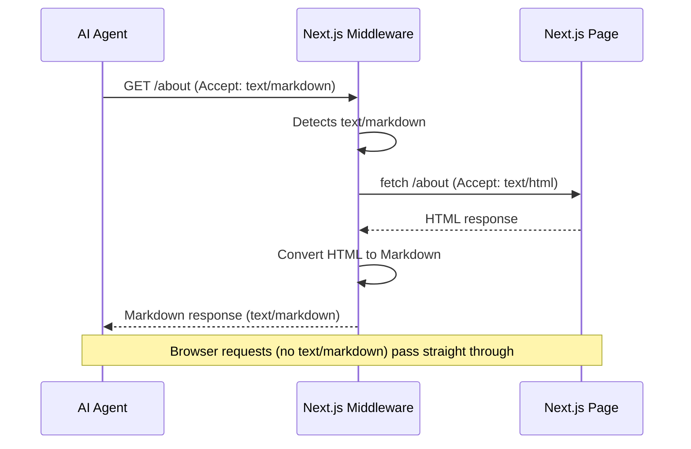

# @markdown-for-agents/nextjs

[](https://www.npmjs.com/package/@markdown-for-agents/nextjs) [](https://www.npmjs.com/package/@markdown-for-agents/nextjs)
[](https://www.npmjs.com/package/@markdown-for-agents/nextjs) [](https://github.com/KKonstantinov/markdown-for-agents/blob/main/LICENSE)

Next.js middleware for [markdown-for-agents](https://www.npmjs.com/package/markdown-for-agents) — a runtime-agnostic HTML to Markdown converter built for AI agents.


> [markdown-for-agents](https://www.npmjs.com/package/markdown-for-agents) converts HTML to clean, token-efficient Markdown for AI agents — typically saving 80–90% of tokens. This package adds automatic content negotiation to your Next.js app via `Accept: text/markdown`.
> **[Try the playground](https://markdown-for-agents-playground.vercel.app)** to see the core conversion in action.

Add a proxy and AI agents get clean, token-efficient Markdown instead of HTML. Normal browser requests pass through untouched. Includes a built-in rule that unwraps Next.js `/_next/image` optimization URLs back to their original paths.

## How it works

The middleware uses content negotiation. When a client sends `Accept: text/markdown` (or is a known AI agent when `detectAgents` is enabled), HTML responses are automatically converted to Markdown. The response includes:

- `Content-Type: text/markdown; charset=utf-8`
- `x-markdown-tokens` header with the token count
- `ETag` header with a content hash for cache validation
- `Vary: Accept` header so CDNs cache HTML and Markdown separately
- `content-signal` header with publisher consent signals (when configured)
- `Server-Timing` and `x-markdown-timing` headers with conversion timing (when `serverTiming: true`)

## Install

```bash
npm install @markdown-for-agents/nextjs markdown-for-agents
```

> `markdown-for-agents` is installed automatically as a dependency.

## Usage

Use a [Next.js proxy](https://nextjs.org/docs/app/building-your-application/routing/middleware) for site-wide conversion. The proxy checks the `Accept` header and fetches the page as HTML before converting:

```ts
// proxy.ts
import { NextRequest, NextResponse, NextFetchEvent } from 'next/server';
import { withMarkdown } from '@markdown-for-agents/nextjs';

const options = {
    extract: true,
    deduplicate: true,
    contentSignal: { aiTrain: true, search: true, aiInput: true }
};

export async function proxy(request: NextRequest, event: NextFetchEvent) {
    const accept = request.headers.get('accept') ?? '';
    if (!accept.includes('text/markdown')) {
        return NextResponse.next();
    }

    const handler = withMarkdown(async (req: NextRequest) => fetch(req.url, { headers: { accept: 'text/html' } }), { ...options, baseUrl: request.nextUrl.origin });

    return (await handler(request, event)) ?? NextResponse.next();
}

export const config = {
    matcher: ['/', '/about', '/blog/:slug*']
};
```

#### How it works

The inner `fetch` sends `accept: 'text/html'`, so when the request re-enters the proxy it hits the early `return NextResponse.next()` and renders the page normally — no infinite loop. Only `Accept: text/markdown` requests take this path; all other traffic passes straight through.



#### Tradeoffs

This pattern makes a **second HTTP request** to your own server for every Markdown conversion. Next.js proxy runs _before_ page rendering and has no access to the response body, so there is no way to avoid this round trip within Next.js itself.

In practice this is usually fine:

- **Latency** — the second request is localhost-to-localhost (or edge-to-edge on Vercel), so it adds minimal overhead.
- **Compute** — your page renders twice for AI agent requests. For static or ISR pages this is a cache hit. For dynamic pages the extra render is the main cost.
- **Scope control** — use `config.matcher` to limit which routes are eligible, so non-content pages (API routes, auth, assets) are never double-fetched.

#### Real-world timing

Measured on a production Next.js site deployed to Vercel (enable with `serverTiming: true`). The `x-markdown-timing` header breaks down the two phases. Token counts are for the converted Markdown output:

| Page                | Tokens | Vercel cache | Proxy fetch | Conversion | Total     |
| ------------------- | ------ | ------------ | ----------- | ---------- | --------- |
| Landing page        | ~500   | HIT          | 31ms        | 1.4ms      | **32ms**  |
| About page (cold)   | ~1,000 | PRERENDER    | 325ms       | 1.7ms      | **327ms** |
| About page (warm)   | ~1,000 | HIT          | 43ms        | 1.5ms      | **45ms**  |
| Long article (cold) | ~3,200 | PRERENDER    | 443ms       | 76ms       | **519ms** |
| Long article (warm) | ~3,200 | HIT          | 36ms        | 21ms       | **57ms**  |

Takeaways:

- **Conversion is fast** — 1-21ms for cached pages, up to ~76ms for a 3,200-token article on a cold hit.
- **Proxy fetch dominates** — the self-fetch to get the HTML is the main cost, not the Markdown conversion.
- **ISR/static pages are nearly free** — once Vercel has cached the HTML, the proxy fetch drops to 30-45ms (edge-to-edge).
- **Cold hits include SSR time** — the 300-440ms proxy fetch on `PRERENDER` is Next.js rendering the page server-side. Subsequent requests are fast.

`withMarkdown` automatically includes `nextImageRule`, which unwraps `/_next/image` optimization URLs back to their original paths. For example, `/_next/image?url=%2Fphoto.png&w=640&q=75` becomes `/photo.png` in the markdown output.

You can also use `nextImageRule` standalone with the core `convert` function:

```ts
import { nextImageRule } from '@markdown-for-agents/nextjs';
import { convert } from 'markdown-for-agents';

const { markdown } = convert(html, { rules: [nextImageRule] });
```

> **Full working example:** See [`examples/nextjs/`](https://github.com/KKonstantinov/markdown-for-agents/tree/main/examples/nextjs) for a complete Next.js app demonstrating the proxy pattern with integration tests.

## Options

Accepts all [`markdown-for-agents` options](https://www.npmjs.com/package/markdown-for-agents#options):

```ts
const handler = withMarkdown(async req => fetch(req.url, { headers: { accept: 'text/html' } }), {
    // Strip nav, ads, sidebars, cookie banners
    extract: true,

    // Resolve relative URLs
    baseUrl: 'https://example.com',

    // Remove duplicate content blocks
    deduplicate: true,

    // Custom token counter (e.g. tiktoken)
    tokenCounter: text => ({ tokens: enc.encode(text).length, characters: text.length, words: text.split(/\s+/).filter(Boolean).length }),

    // Publisher consent signal header
    contentSignal: { aiTrain: true, search: true, aiInput: true },

    // Auto-detect AI agents by User-Agent (ClaudeBot, GPTBot, etc.)
    detectAgents: true,

    // Log conversion events (compatible with pino, winston, console)
    logger: console
});
```

## Other frameworks

| Package                                                                                      | Framework                                    |
| -------------------------------------------------------------------------------------------- | -------------------------------------------- |
| [`@markdown-for-agents/express`](https://www.npmjs.com/package/@markdown-for-agents/express) | Express                                      |
| [`@markdown-for-agents/fastify`](https://www.npmjs.com/package/@markdown-for-agents/fastify) | Fastify                                      |
| [`@markdown-for-agents/hono`](https://www.npmjs.com/package/@markdown-for-agents/hono)       | Hono                                         |
| [`@markdown-for-agents/web`](https://www.npmjs.com/package/@markdown-for-agents/web)         | Web Standard (Cloudflare Workers, Deno, Bun) |

## License

MIT
